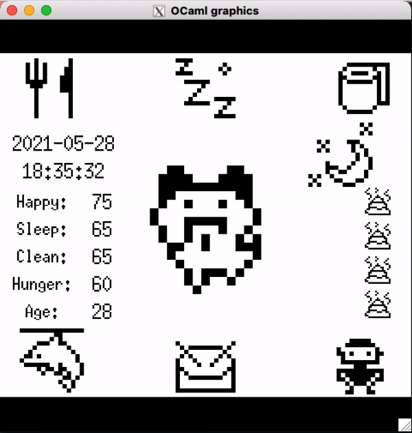
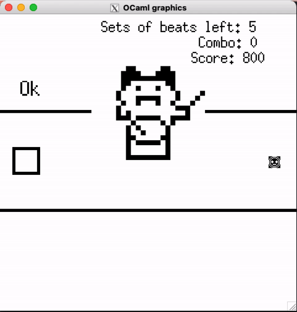
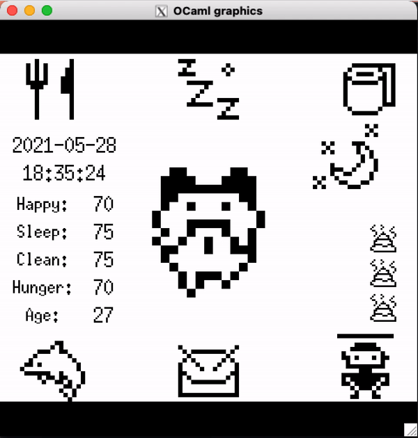
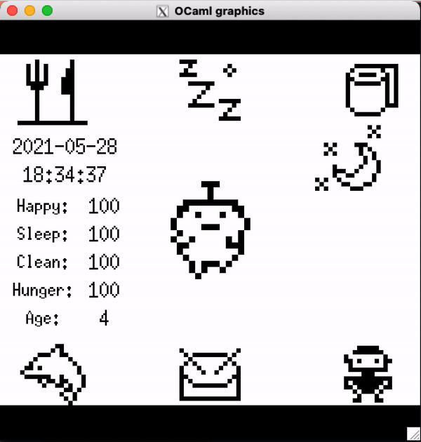
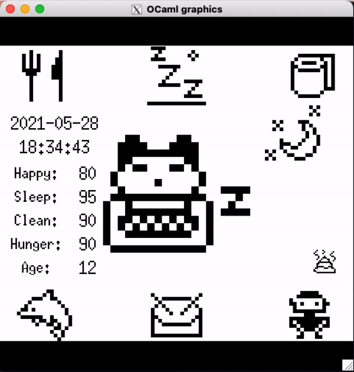

# Tamagotchi: OCaml Simulation

_Final Project for CS 3110 - Functional Programming_

By: Justin Ngai, Shungo Najima, Stephen Yu, Justin Zhang

## Overview:

In this project we attempt to implement the Tamagotchi experience using low-level OCaml modules. By utilizing simple and cute pixel art and an array of interactive mini-games, we attempted to recreate the wholesome childhood experience. Specifically, there are three mini-games: dolphin obstacle, drumming rhythm, and elementals (our version of rock-paper-scissors) game.

The player is also able to take care of their Tamagotchi pet by feeding it, letting it sleep, and cleaning up after it. In the home menu, the Tamagotchi’s statuses (happiness, sleep, cleanliness, and hunger) are displayed numerically, and if any of them drop to 0, the Tamagotchi passes away. As a result, the player has to strategically take care of their Tamagotchi. Subsequent features were also added like age and system time (which corresponds to either a sun or moon displayed on the home screen)

## Setup

-   Install all required modules listed in `src/INSTALL.txt`
-   `cd src`
-   `make play`
